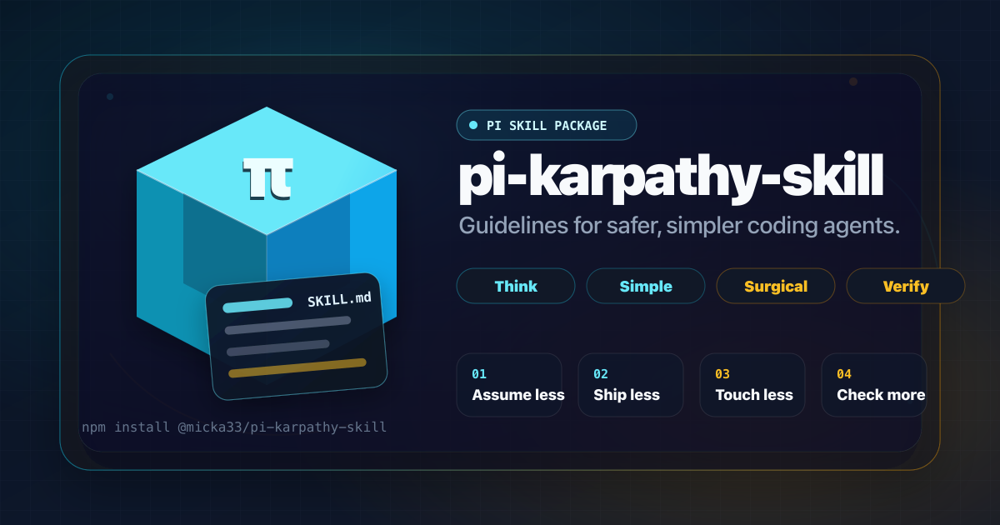

# pi-karpathy-skill

<p align="center">
  
</p>

Pi package that provides the `karpathy-guidelines` skill to coding agents.

The skill contains behavioral guidelines inspired by [Andrej Karpathy's observations](https://x.com/karpathy/status/2015883857489522876) on common LLM coding pitfalls: think before coding, keep solutions simple, make surgical changes, and define verifiable success criteria.

## Install

From npm:

```bash
pi install npm:@micka33/pi-karpathy-skill
```

From this repository:

```bash
pi install git:git@github.com:Micka33/pi-karpathy-skill.git@latest
```

For project-local installation: Use the `-l` flag:

```bash
pi install -l npm:@micka33/pi-karpathy-skill@latest
```

## Usage

Pi auto-discovers the skill from this package. You can also force-load it in a pi session:

```text
/skill:karpathy-guidelines
```

## Package contents

```text
skills/
└── karpathy-guidelines/
    └── SKILL.md
```

## Publishing

Releases are published automatically by GitHub Actions when a semver tag is pushed:

```bash
git tag v0.1.0
git push origin v0.1.0
```

The release workflow for an agent publishing the next version:

1. Run `git fetch --tags --force && git tag --list 'v[0-9]*.[0-9]*.[0-9]*' --sort=-v:refname | head -n 1` to get the highest existing `vX.Y.Z` git tag in the repo.
2. Choose the next semver version by bumping it according to the requested changes.
3. Ask the user to confirm the next version you chose.
4. Create and push a matching tag, for example `git tag v0.0.1 && git push origin main v0.0.1`.
5. Verify the GitHub Actions release run succeeds.

## Attribution

Skill content is adapted from [`multica-ai/andrej-karpathy-skills`](https://github.com/multica-ai/andrej-karpathy-skills) and is licensed MIT.
